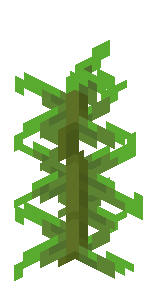

## Minecraft GUI  


**Author:** Míriam Domínguez Martínez  
**Status:** In progress  
**Live:** [](#)

---

### About

Interactive Minecraft-style inventory UI built with HTML - CSS - JavaScript. Faithful recreation of the in-game inventory panel featuring drag-and-drop items, pixel-perfect rendering, procedural sound effects via the Web Audio API, and persistent state through localStorage.

---

### File Structure

```
minecraft-gui/
├── index.html
├── style.css
├── main.js
├── items.js
├── README.md
├── items/
│   ├── Arrow.png
│   ├── Bamboo.png
│   ├── Blue_Egg.png
│   ├── Bush.png
│   ├── Emerald.png
│   ├── Eye_of_Ender.png
│   ├── Flow_Banner_Pattern.png
│   ├── Iron_Hoe.png
│   ├── Locked_Map.png
│   ├── Mangrove_Propagule.png
│   ├── Milk_Bucket.png
│   ├── Music_Disc.png
│   ├── Name_Tag.png
│   ├── Painting.png
│   ├── Potion_of_Oozing.png
│   ├── Sea_Pickle.png
│   ├── Seagrass.png
│   ├── Slime_Spawn_Egg.png
│   ├── Sugar_Cane.png
│   ├── Torchflower_Seed.png
│   ├── Turtle_Egg.png
│   ├── Weathered_Copper_Lantern.png
│   ├── White_Candle.png
│   └── World.gif
└── fonts/
    └── PressStart2P-Regular.ttf
```

---

### Colour Palette

```
--mc-bg:      #c6c6c6   panel background grey
--mc-darker:  #373737   dark bevel edge (bottom-right)
--mc-light:   #ffffff   light bevel edge (top-left)
--mc-slot:    #8b8b8b   empty slot fill
--mc-label:   #3d3d3d   section label text
--tooltip-bg: #100010   tooltip dark purple-black
--page-bg:    #f0f0f0   outer page background
```

---

*Currently studying and building every day.* 🌱
